# Лабораторная работа №7: Управление процессами в Linux

# 1. Запуск задач в активном и фоновом режиме

* Запуск задачи в активном и фоновом режиме;
* Заставить задачу выполнятся после выхода из системы;
* Отслеживать и сортировать активные процессы;
* Завершать процессы;

**Понятия:**

* Fg (foreground) и bg (background);
* Nohup (no hang up);
* Ps - информация об активных процессах;
* Pstree - дерево процессов;
* Pgrep - поиск процессов;
* Pkill - завершение процессов;
* Top - диспетчер задач;
* Free - загрузка оперативной памяти;
* Uptime - время и полнота загрузки;
* Screen - управление сессиями.
* Background (фоновый режим) — процесс работает параллельно, терминал свободен.

## Создание процессов в Linux
В Linux существует несколько методов создания процессов:

```fork()``` — используется для создания нового процесса путем дублирования существующего. Новый процесс является точной копией родительского, за исключением нескольких значений.

```exec()``` — используется для замены текущего образа процесса на новый. Этот метод позволяет выполнить другую программу в текущем процессе.

```system()``` — создает новый процесс для работы команды, указанной в качестве аргумента. Метод ожидает завершения выполнения команды и возвращает статус ее выхода.

```clone()``` — похож на fork(), но обеспечивает больший контроль над поведением нового процесса. Он позволяет указать различные флаги для управления совместным использованием ресурсов между родительским и дочерним процессами.

*Процесс инициализации* относится к первому (главному) процессу, который запускается ядром во время загрузки. Он имеет идентификатор PID, равный 1. Его название разнится в зависимости от версии или семейства дистрибутива — init или systemd.

Для определения PID существует утилита pidof. Чтобы она определила идентификатор процесса, нужно просто указать его название в качестве аргумента команды:

```bash
pidof snapd
pidof cron
```
Вы можете определить идентификатор процесса текущей оболочки bash. Для этого введите:
```bash
echo $$
``` 
Чтобы узнать идентификатор родительского процесса этой оболочки, выполните команду:
```bash
echo $PPID
```

# Начнем разбирать данную тему с простой команды.

## Управление режимами:
* **Запуск в фоне**: после добавления & в команду терминал теперь не блокируется и процесс выполняется в фоновом режиме
  ```bash
  sleep 100 &
  ```

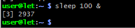

* **Приостановка процесса**: нажмите `Ctrl + Z` (переводит активный процесс в статус `stopped`).

* **Просмотр фоновых задач**: команда `jobs`.

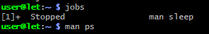
* **Перевод в фон (`bg`)**: возобновляет остановленный процесс в фоновом режиме.

* bg %2


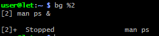
* **Перевод в активный режим (`fg`)**: возвращает фоновый процесс на передний план.
* fg %1


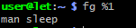
---

## 2. Запуск процессов после выхода из системы (Управление сессиями)

При закрытии терминала процессам посылается сигнал `SIGHUP` (завершение). Способы обойти это:

### Утилита `nohup` (No Hang Up)
Игнорирует сигнал закрытия терминала. Вывод автоматически перенаправляется в файл `nohup.out`.

* nohup ping google.com &

---

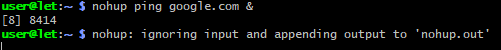

## 3. Отслеживание и сортировка активных процессов

### Команда `ps` (Статический снимок процессов)
* `ps aux` — показывает процессы всех пользователей с подробностями.

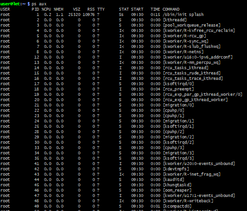

* `ps -ef` — стандартный синтаксис для отображения всех процессов.

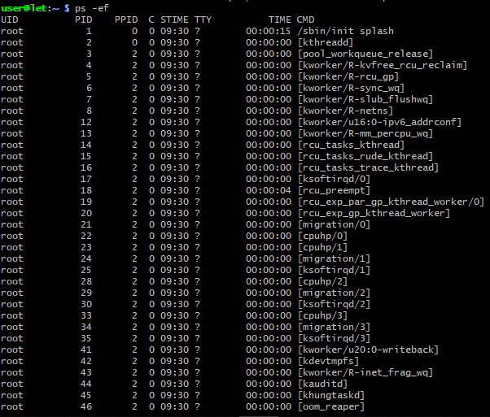

### Команда `pstree` (Дерево процессов)
Показывает иерархию (родительские и дочерние процессы).

* pstree -p
*(Флаг `-p` выводит PID процессов).*

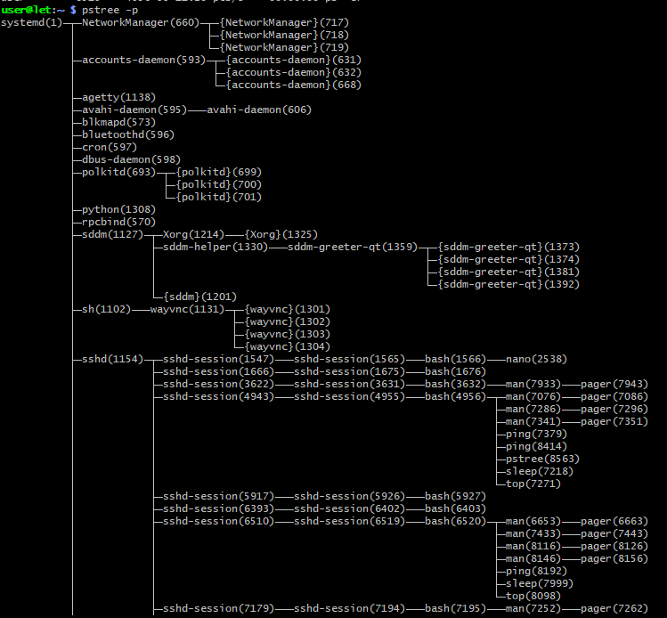

### Команда `top` (Динамический диспетчер задач)

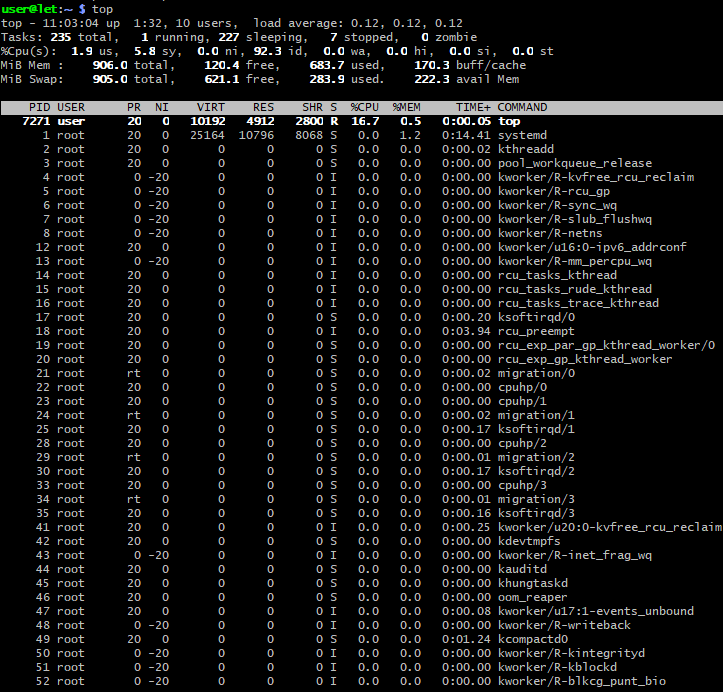

Отображает процессы в реальном времени.

### Поиск процессов: `pgrep`
Находит PID (идентификатор) процесса по его имени.

* pgrep -l nginx

---

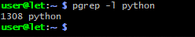

## 4. Мониторинг ресурсов системы

### Команда `free` (Оперативная память)
Показывает объем занятой и свободной памяти RAM и Swap.

* free -h

*(Флаг `-h` выводит данные в удобном для чтения виде: Мб, Гб).*

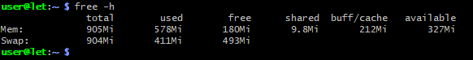

### Команда `uptime` (Время работы и нагрузка)
Показывает текущее время, время аптайма, количество пользователей и `Load Average` (среднюю нагрузку за 1, 5 и 15 минут).

* uptime


---

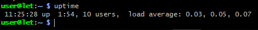

## 5. Завершение процессов

Уничтожение процессов происходит путем отправки им сигналов (например, `SIGTERM` или `SIGKILL`).

### Команда `kill`
Завершает процесс по его `PID`.
* kill 1234

*Если процесс не реагирует (принудительное завершение)*
* kill -9 1234

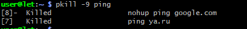

### Команда `pkill`
Завершает процессы по их **имени**, а не по PID.
* pkill -9 nginx


[def]: 2.png

# Конец. Спасибо за внимание :)
# Пасхалки. Интересные баг-лаги на git

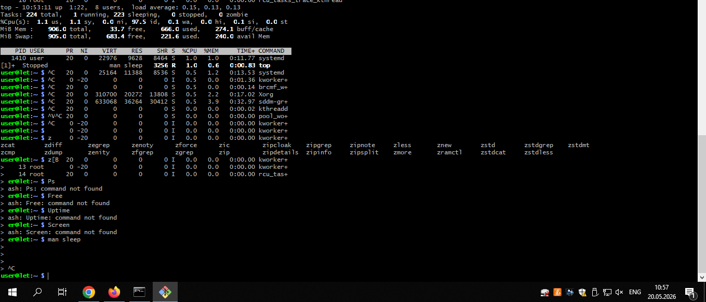

