# Лаба №8

# Система журналирования в операционных системах Linux
Система журналирования в операционных системах Linux работает на базе демона journald, который занимается обработкой сообщений от служб, initrd, ядра и т.д. Доступ к собранной в журнале информации осуществляется путем использования утилиты journalctl. Она же дает возможности для управления: делать фильтрацию, менять формат отображения, мониторить активные процессы и пр.

## Общая информация
Основная задача журнальной системы systemd — централизация управления собираемыми данными независимо от источника. При помощи демона journald система объединит информацию в двоичном формате. Это позволяет повысить гибкость настройки и одинаково легко работать с задачами любой сложности. Например, комбинировать записи нескольких служб для выявления общей проблемы.

Система журналирования systemd универсальная. Ее применяют вместе с действующей syslog, вместо syslog и в качестве дополнения активных механизмов заполнения журнала. Допускается и объединение технологий, если этого требует выполнение конкретных задач.

## Настроим системное время
Хранение журнала в двоичном формате позволяет просматривать записи в двух режимах: локальное время и время по Гринвичу (UTC). Стандартным считается первый из вариантов. Но перед началом работы желательно выяснить, какой часовой пояс указан. Поможет нам инструмент timedatectl, включенный в пакет systemd.

Сначала просмотрим все имеющиеся в системе часовые пояса:

## Код: ```timedatectl list-timezones```

## Итог:
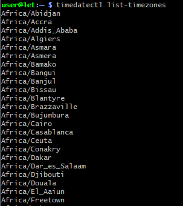

## Код: 
```sudo timedatectl set-timezone (zone) ``` 

Меняем время на любой часовой помощь меняя команду ```zone```
Чтобы нам вывело итог, добавялем:

```timedatectl с опцией status```

## Итог: 

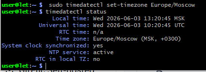

## Код: 
```journalctl```

Просмотр содержимого журнала
Информацию, собранную демоном journald, просматривают командой Linux journalctl. 

Если ее применяют отдельно, вывод журнала будет представлять многостраничный список с размещением старых записей наверху:
## Итог: 

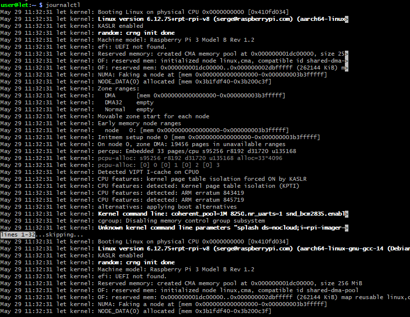

## Код: 
При необходимости заменить временные метки на формат UTC запустим утилиту с флагом:
    
```journalctl –utc```

Вывод журналов текущей загрузки

Самый простой и часто используемый флаг: ```-b```. Он помогает просмотреть записи журнала, которые были собраны с момента последнего по времени включения компьютера (или перезагрузки):

```journalctl –b```

## Итог:

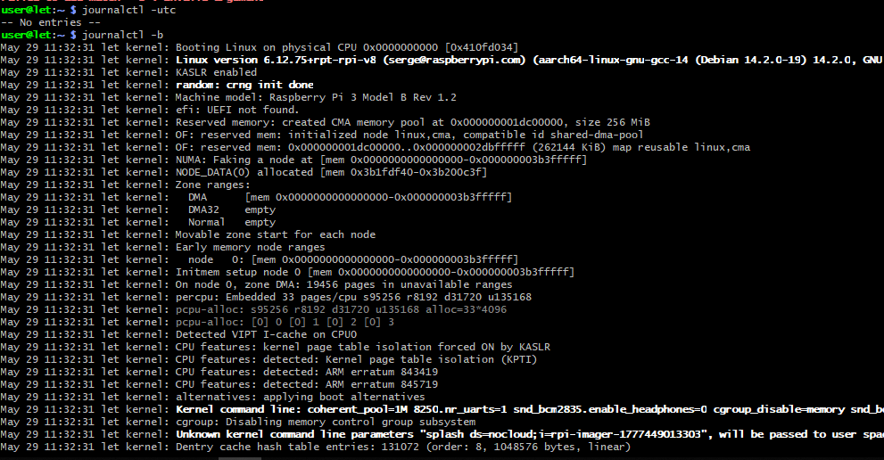

## Дополнительно: 
В списке будет отображена только та информация, которая реально важна для запуска системы, без сохраняемой во время ее работы. 

В общем журнале также есть возможность найти эти данные по маркеру:
  
```Reboot```

## Код+итог: 
Перед началом работы лучше принудительно создать папку, где будет храниться файл:

```sudo mkdir -p /var/log/journal```


Команда для редактирования конфигурационного файла системы ведения журналов systemd:

```sudo nano /etc/systemd/journald.conf```

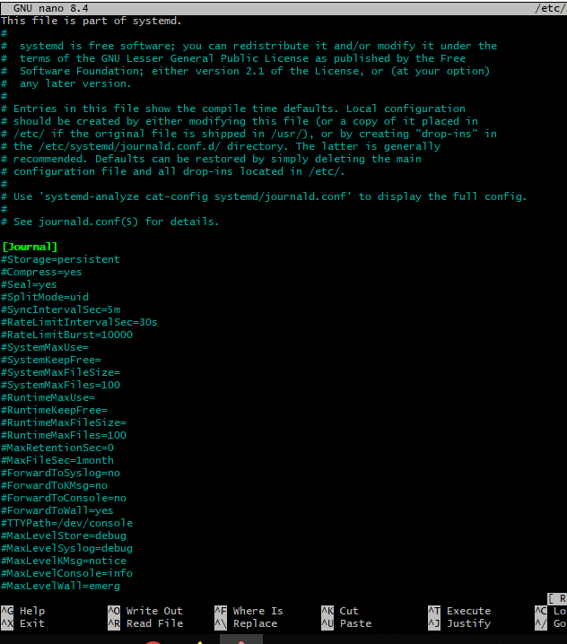

Найдите раздел ```Journal``` и установите в нем для опции ```Storage=``` значение ```persistent```. Это активирует хранение информации без ее удаления.

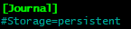

# Временные окна

На серверах, работающих без перезапуска, актуальность сведений по загрузке системы практически нулевая. Зато полезна информация о ключевых событиях, которую будем искать при помощи опций –since и –until, ограничивающих вывод записей утилитой journalctl по времени. 

После внесенного или до приведенного значения (формат YYYY-MM-DD HH:MM:SS).

Ввод команды:

```journalctl --since "2022-01-10 17:15:00"```

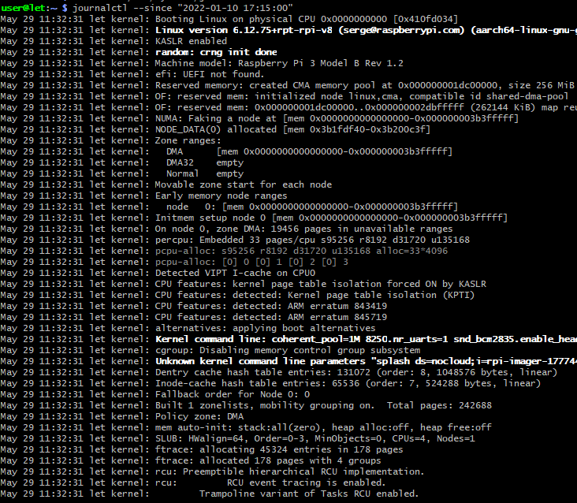

Если указать только время, система автоматически подставит текущую дату. Вместо неуказанного времени подставляется значение 00:00:00. То же происходит при пропуске поля секунд, которое обычно непринципиально для изучения ситуации. Есть возможность применять «относительные» значения, например yesterday (вчера).

```journalctl --since yesterday```

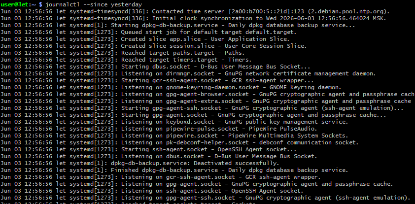

Пример команды, когда требуется получить отчет по сбоях, произошедших 1 час назад:

```journalctl --since 09:00 --until "1 hour ago"```

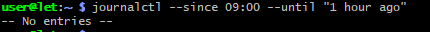

# Фильтр по значимости

Помимо временных критериев, команда ```journalctl``` включает фильтрацию по важным службам или их компонентам. Система systemd поддерживает несколько способов.
По единицам

Фильтрацию по единицам включает опция ```-u```. Так, если требуется вывести журнал только по ```Nginx```, введем команду:

```journalctl -u nginx.service```

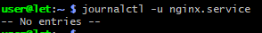

Возможно совмещение с диапазоном времени:

```journalctl -u nginx.service --since today```

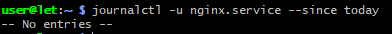

По процессу (пользователю, идентификатору группы) Часть служб во время работы создает дочерние процессы, которые и могут заинтересовать нас при разборе ситуации. Понадобится точное значение PID конкретного процесса, по которому и будет работать фильтрация. Пример:

```journalctl _PID=7077```

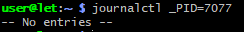

# По пути компонента

Команда позволяет указывать путь к исполняемому файлу, информацию о котором требуется сейчас изучить. Пример для фильтрации по bash:

```journalctl /usr/bin/bash```

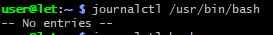

В зависимости от файла возможно отображение и дочерних процессов (иногда это не работает).

# Отображение сообщений ядра

Система журналирования поддерживает вывод сообщения ядра операционной системы Linux. Вся информация будет содержаться в dmesg. При вводе команды при этом используют опции –dmesg или -k.

```journalctl -k```

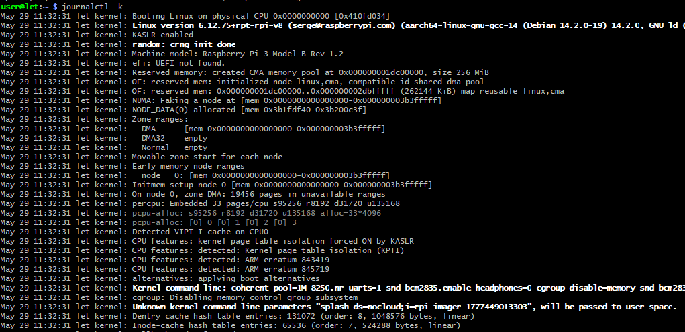

В стандартный вывод попадают сообщения только из текущего сеанса. Но пользователю доступна возможность указания другого. Например, для получения данных по «пятому сеансу» загрузки от текущего используем команду:

```journalctl -k -b -5```

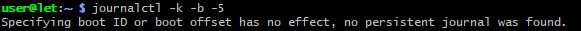

# По приоритету

Интересна фильтрация по приоритету сообщений. Это позволяет временно убрать информацию с низким приоритетом, чтобы не отвлекаться и не путаться при изучении ситуации. Выполняется операция при помощи опции -p с добавкой категории сообщений. Например, просмотрим все ошибки:

```journalctl -p err –b```

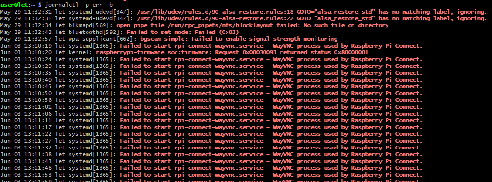

# Вывод

Мы разобрали, как использовать утилиту ```journalctl``` в основных режимах. 


Она весьма полезна для системных администраторов за счет гибкой фильтрации данных при чтении журналов. Расширение функций осуществляется за счет применения различных опций, основные из которых рассмотрели в текущей работе