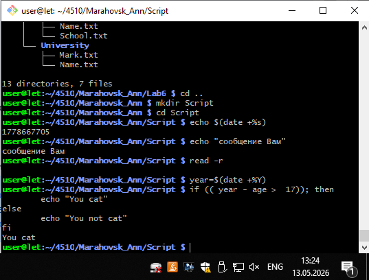
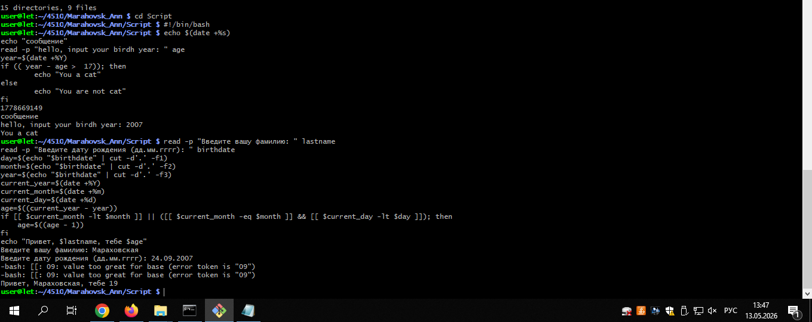
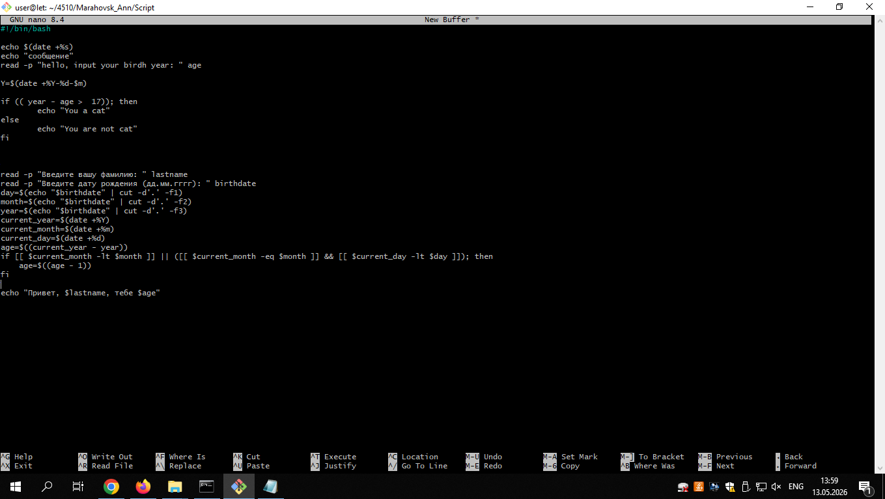

# Лабораторная по скрипту

**Готовый код** 
!/bin/bash

current_date=$(date +"%Y-%m-%d") 
echo $current_date   #выводим текущую дату

echo "Мараховская Анна"   #сообщение с фамилией и именем

read -p "Введите год рождения: " age 

year=$(date +%Y)   #текущий год

if ((year - age >  17)); then
        echo "Ты котик"
else
        echo "Ты не котик"
fi

read -p "Введите вашу фамилию: " lastname   #ввод фамилии
read -p "Введите дату рождения (дд.мм.гггг): " birthdate   #ввод даты рождения
day=$(echo "$birthdate" | cut -d'.' -f1)   #получения дня рождения пользователя
month=$(echo "$birthdate" | cut -d'.' -f2)   #получение месяца рождения пользователя
year=$(echo "$birthdate" | cut -d'.' -f3)   #получение года рождения пользователя
current_year=$(date +%Y)   #получения текущего года
current_month=$(date +%m)   #получения текущего месца
current_day=$(date +%d)   #получения текущего дня
age=$((current_year - year)) 
if [[ $current_month -lt $month ]] || ([[ $current_month -eq $month ]] && [[ $current_day -lt $day ]]); then
    age=$((age - 1))   #вычисление возраста
fi

#
echo "Привет, $lastname, тебе $age"   #вывод фамилии и возраста

# Скриншот с компьютера
**Задание №1**

**Задание №2. Получившийся скрипт**

**Код скрипта в nano**

**Добавление**
current_date=$(date +"%Y-%m-%d")
echo current_date #Вывод текущей даты

