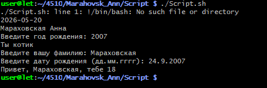
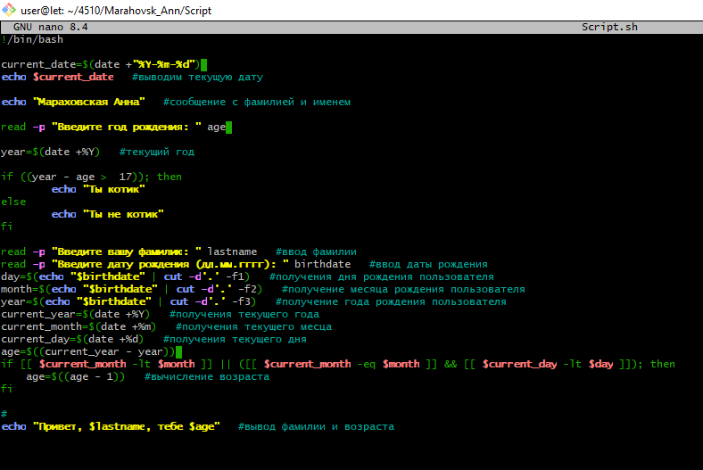

# Лабораторная по скрипту

**Ссылка на готовый код** 

# Скриншот с компьютера

**Задание №2. Получившийся скрипт**

**Код скрипта в nano**

**Важное добавление для работы текущей даты и её вывода**

current_date=$(date +"%Y-%m-%d")
echo current_date #Вывод текущей даты

