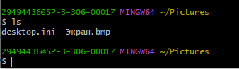
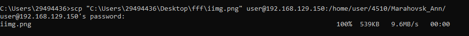
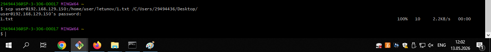

# Лабораторная 5. Подключение по VNC.
# Вход с помощью VNC через VNC Viever.
**Ввод IP**

**Ввод логина и пароля**

**Подключились**

**Сохранили картинку на своем компе**

**Скопировали**

**Скачивание файла с удаленного компьютера**

